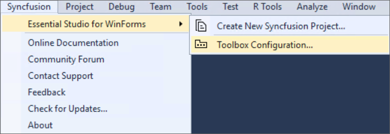
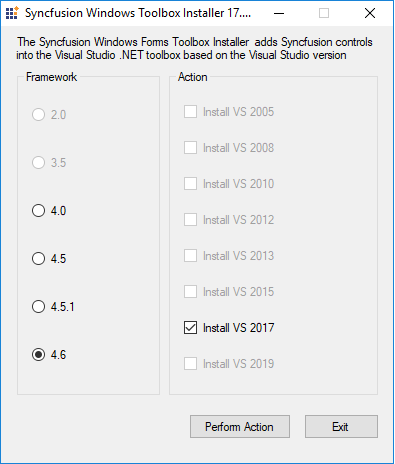
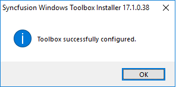

# Toolbox Configuration

The Syncfusion® Toolbox utility adds the Syncfusion® WinForms controls into the Visual Studio .NET toolbox.

N> Visual Studio Express Edition does not support toolbox configuration. However, you can manually configure the Syncfusion® controls into the Visual Studio Express Toolbox. To do so, refer the [Manual Toolbox Configuration](https://help.Syncfusion.com/common/faq/how-to-configure-the-toolbox-of-visual-studio-manually).

Syncfusion® controls will be automatically configured in the Visual Studio toolbox, while installing the Syncfusion® Windows Forms installer, if the <b>“Configure Syncfusion® Controls in Visual Studio”</b> checkbox is selected from installer UI.

Use the following steps to add the Syncfusion® WinForms controls through the Syncfusion® Toolbox Installer:

1. To launch Toolbox configuration utility, follow either one of the options below:

   **Option 1:**   
   To open the Syncfusion® Control Panel, click **Add On and Utilities > Toolbox Installer**.
   
   
   
   **Option 2:**  
   Click **Syncfusion® menu** and choose **Essential Studio® for WinForms > Toolbox Configuration...** in **Visual Studio**.

   

   N> From Visual Studio 2019, Syncfusion® menu is available under Extensions in Visual Studio menu.

2. Toolbox Installer will be opened.

   

   The following options are available in Toolbox Configuration:

   * Install VS2005 – Configures Framework 2.0 Syncfusion® controls in VS 2005 toolbox.
   * Install VS2008 – Configures Framework 3.5 Syncfusion® controls in VS 2008 toolbox.
   * Install VS2010 – Configures Framework 4.0 Syncfusion® controls in VS 2010 toolbox.
   * Install VS2012 – Configures Framework 4.5 Syncfusion® controls in VS 2012 toolbox.
   * Install VS2013 – Configures Framework 4.5.1 Syncfusion® controls in VS 2013 toolbox.
   * Install VS2015 – Configures Framework 4.6 Syncfusion® controls in VS 2015 toolbox.
   * Install VS2017 – Configures Framework 4.6 Syncfusion® controls in VS 2017 toolbox.
   * Install VS2019 – Configures Framework 4.6 Syncfusion® controls in VS 2019 toolbox
   * Install VS2022 – Configures Framework 4.6 Syncfusion® controls in VS 2019 toolbox
   
    N> You can also configure Syncfusion® controls from a lower version Framework assembly to higher version of Visual Studio.
   
3. The successful configuration of Toolbox is indicated by an Information message. Click **OK**.

   
   
   
   N> * You must reset the toolbox, when the installed controls are not reflected properly in the Toolbox. * This tool configures only the controls that are located under {Installed Location}\Assemblies\{Framework version}.
   
