# Troubleshoot the project

Troubleshoot the project with the Syncfusion&reg; configuration and apply the fix for issues such as adding a Syncfusion&reg; assembly to the project with the wrong .NET Framework version, or missing any Syncfusion&reg; dependent assembly of a referred assembly. The Syncfusion&reg; Troubleshooter is capable of performing the following tasks:

* Report the configuration issues.
* Apply the solution.

## Report the Configuration issues

The following steps help you use the Syncfusion&reg; Troubleshooter in Visual Studio.

> Before using the Syncfusion&reg; Troubleshooter for WinForms, check whether the **WinForms Extensions - Syncfusion&reg;** is installed or not in the Visual Studio Extension Manager by clicking on Tools -> Extensions and Updates -> Installed for Visual Studio 2017 or lower, and for Visual Studio 2019 or later by clicking on Extensions -> Manage Extensions -> Installed. If this extension is not installed, please install the extension by following the steps from the [download and installation](https://help.Syncfusion.com/windowsforms/visual-studio-integration/vs2019-extensions/download-and-installation/) help topic.

1. To open the Syncfusion&reg; Troubleshooter Wizard, follow either one of the options below: 
   
   **Option 1:**  
   Open an existing Syncfusion&reg; WinForms Application, click **Syncfusion&reg; Menu** and choose **Essential Studio&reg; for WinForms > Troubleshoot…** in Visual Studio.

   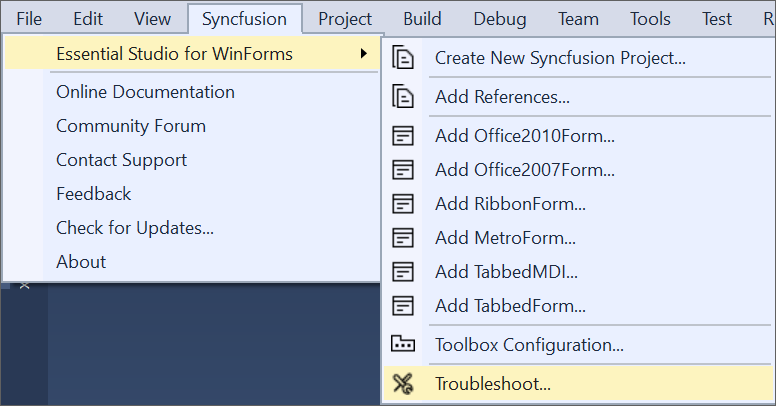

   N> From Visual Studio 2019, Syncfusion&reg; menu is available under Extensions in Visual Studio menu.

   **Option 2:**  
   Right-click the Project file in Solution Explorer, then select the command Syncfusion&reg; Troubleshooter…

   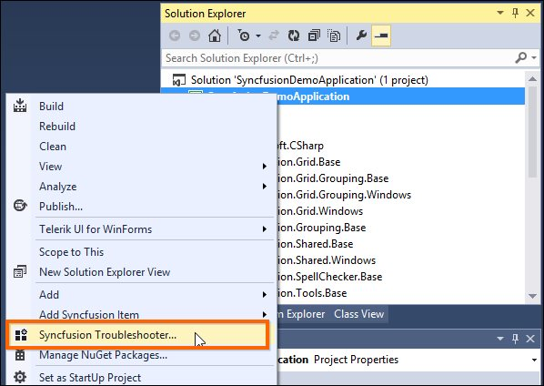

2. The project will now be analyzed, and if any Syncfusion&reg; project configuration errors are discovered, they will be reported in the Troubleshooter dialog. If there are no configuration issues with the project, the dialog box will indicate that no modifications are required in the following areas:

* Syncfusion&reg; assembly references.
* Syncfusion&reg; NuGet Packages. 
* Syncfusion&reg; Toolbox Configuration.

   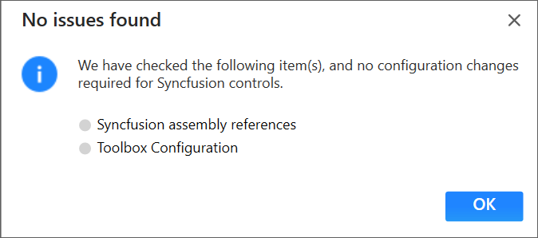

I> The Syncfusion&reg; Troubleshooter command will be visible only for Syncfusion&reg; projects, which means Syncfusion&reg; assemblies or Syncfusion&reg; NuGet packages should be referred to in the project.

The Syncfusion&reg; Troubleshooter handles the following project configuration issues: 

1. Assembly Reference Issues.

2. NuGet related Issues.

3. Toolbox Configuration Issues.

### Assembly Reference Issues

The Syncfusion&reg; Troubleshooter deals with the following assembly reference issues in Syncfusion&reg; Projects. 

1. Dependent assemblies are missing for referred assemblies in the project. 

   **For Instance:** If the "Syncfusion.Grid.Windows" assembly is referred in the project and "Syncfusion.Shared.Windows" (a dependent of Syncfusion.Grid.Windows) is not referred in the project, the Syncfusion&reg; Troubleshooter will show a dependent assembly as missing.

   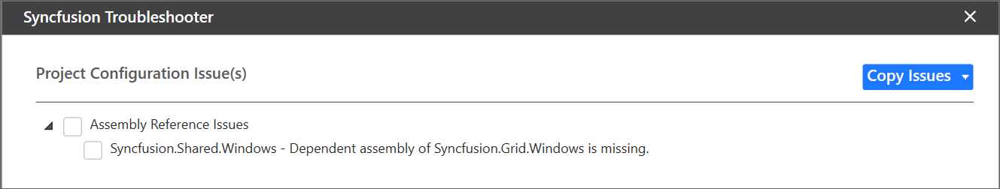

2. Syncfusion&reg; assembly version mismatched. Compare all the Syncfusion&reg; assembly versions in the same project. If any Syncfusion&reg; assembly version inconsistency is found, the Syncfusion&reg; Troubleshooter will show the Syncfusion&reg; assembly version mismatched. 

   **For Instance:** If the "Syncfusion.Tools.Windows" assembly (v15.2450.0.40) is referred in the project, but the other referred Syncfusion&reg; assemblies have an assembly version of v15.2450.0.43, the Syncfusion&reg; Troubleshooter will show the Syncfusion&reg; assembly version mismatched.

   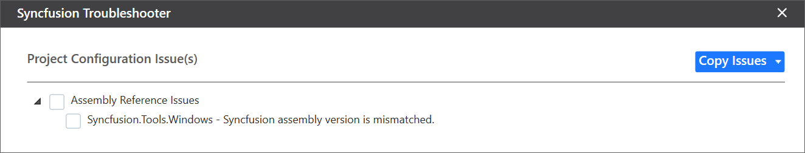

3. Framework version mismatching (Syncfusion&reg; Assemblies) with the project's .NET Framework version. Find the supported .NET Framework details for Syncfusion&reg; assemblies in the following link:

   <https://help.Syncfusion.com/common/essential-studio/assembly-information#supported-framework-version-for-essential-studio-assemblies> 

   **For Instance:** The .NET Framework of the application is v4.5 and the "Syncfusion.Tools.Windows" assembly (v17.1460.0.38 & .NET Framework version 4.6) is referred in the same application. The Syncfusion&reg; Troubleshooter will show that the Syncfusion&reg; assembly .NET Framework version is incompatible with the project's .NET Framework version.

   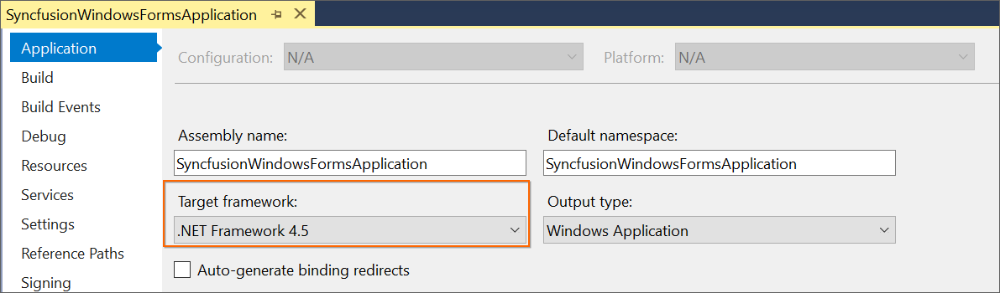

   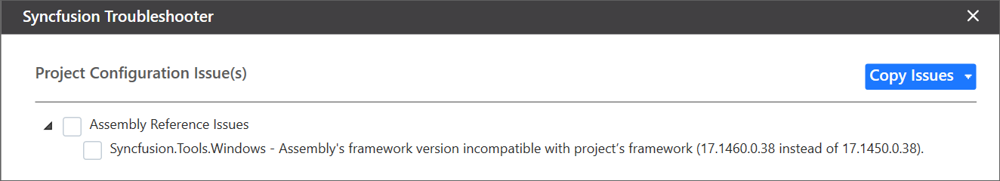

### NuGet Issues

The Syncfusion&reg; Troubleshooter deals with the following NuGet package related issues in Syncfusion&reg; projects. 

1. Multiple versions of Syncfusion&reg; NuGet packages are installed. If a Syncfusion&reg; NuGet package version differs from another Syncfusion&reg; NuGet package version, the Syncfusion&reg; Troubleshooter will show the Syncfusion&reg; NuGet package version as mismatched. 

   **For Instance:** Syncfusion&reg; WinForms platform packages are installed in multiple versions (v16.4.0.54 & v17.1.0.38); the Syncfusion&reg; Troubleshooter will show the Syncfusion&reg; package version mismatched.
 
   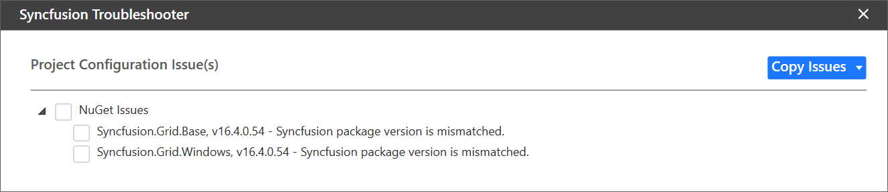

2. The installed Syncfusion&reg; NuGet package's Framework version differs from the project's .NET Framework version.

   **For Instance:** The Syncfusion&reg;.SfBulletGraph.Windows40 NuGet package version (v15.2.0.17 with 4.0 Framework) is installed in the project, but the project's .NET Framework version is 4.5. So, the Syncfusion&reg; Troubleshooter will show the Syncfusion&reg; package Framework version as mismatched.
  
   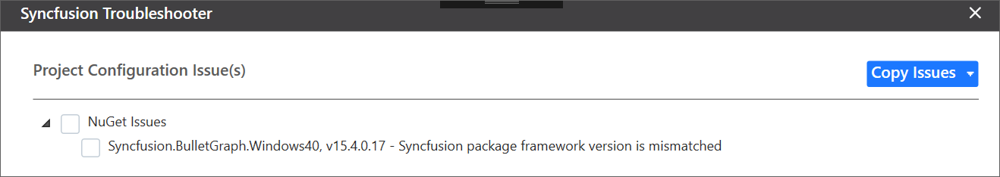

3. A dependent NuGet package of the installed Syncfusion&reg; NuGet packages is missing.

   **For Instance:** If you install the Syncfusion&reg;.Chart.Windows NuGet package alone in the project, the Syncfusion&reg; Troubleshooter will show the Syncfusion&reg;.Chart.Base and other dependent NuGet packages as missing.
 
   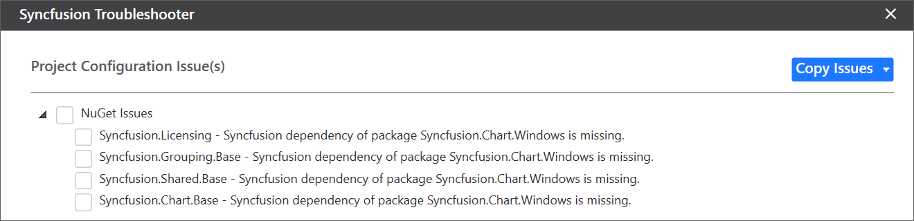

I> Internet connection is required to restore the missing dependent packages. If internet is not available, the dependent packages will not be restored.

### Toolbox Configuration Issues

The Syncfusion&reg; Troubleshooter deals with the following Toolbox Configuration related issues in Syncfusion&reg; projects. 

1. If the Syncfusion&reg; Toolbox is not installed/configured for the project's .NET Framework version, the Syncfusion&reg; Troubleshooter will show the Syncfusion&reg; Toolbox .NET Framework version as mismatched. 

   **For Instance:** The project's .NET Framework version is 4.5, but the Syncfusion&reg; Toolbox is configured only with 4.6 framework assemblies in the corresponding Visual Studio, so the Syncfusion&reg; Troubleshooter will show the Syncfusion&reg; Toolbox framework version as mismatched.
 
   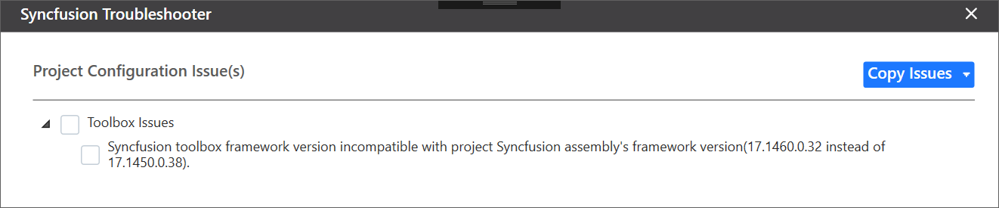

2. If the Syncfusion&reg; Toolbox configured version differs from the latest Syncfusion&reg; assembly reference version or NuGet package version in the same project, the Syncfusion&reg; Troubleshooter will show the Syncfusion&reg; Toolbox version as mismatched.

   **For Instance:** If the latest Syncfusion&reg; assembly reference version is v17.1.0.38, but the Toolbox assemblies are configured with v17.1.0.32, the Syncfusion&reg; Troubleshooter will show the Syncfusion&reg; Toolbox version as mismatched.
  
   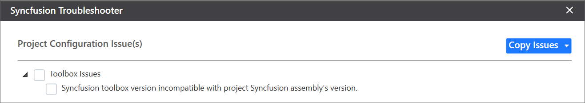

## Apply the solution

1. After loading the Syncfusion&reg; Troubleshooter dialog, check the corresponding check box of the issue to be resolved. Then click the “Fix Issue(s)” button. 

   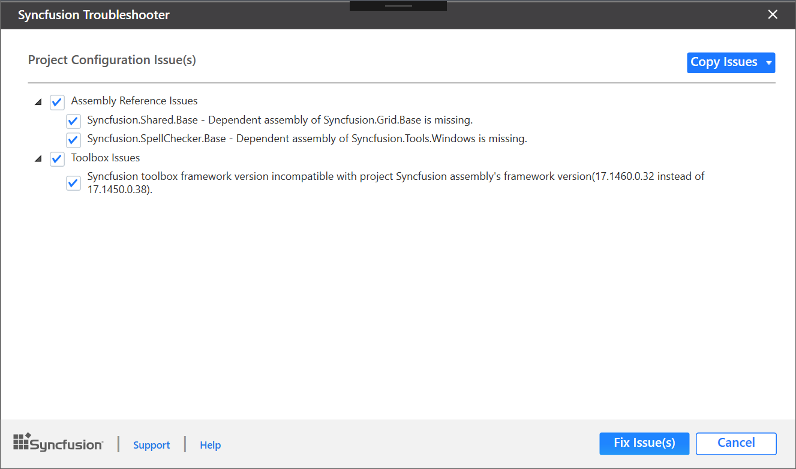

2. A dialog appears, which will ask you to take a backup of the project before performing the troubleshooting process. If you need to back up the project before troubleshooting, click the "Yes" button.

   

3. Wait for a while; the Syncfusion&reg; Troubleshooter is resolving the selected issues. After the troubleshooting process is completed, there will be a status message in the Visual Studio status bar as "Troubleshooting process completed successfully".

   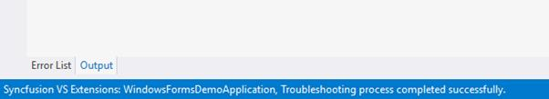

4. Then, a Syncfusion&reg; licensing registration required message box will be shown if you installed the trial setup or NuGet packages, since Syncfusion&reg; introduced the licensing system from the 2018 Volume 2 (v16.2.0.41) Essential Studio&reg; release. Navigate to the  [help topic](https://help.Syncfusion.com/common/essential-studio/licensing/license-key#how-to-generate-Syncfusion-license-key), which is shown in the licensing message box to generate and register the Syncfusion&reg; license key to your project. Refer to this [blog](https://blog.Syncfusion.com/post/Whats-New-in-2018-Volume-2-Licensing-Changes-in-the-1620x-Version-of-Essential-Studio.aspx) post to understand the licensing changes introduced in Essential Studio&reg;.   

   