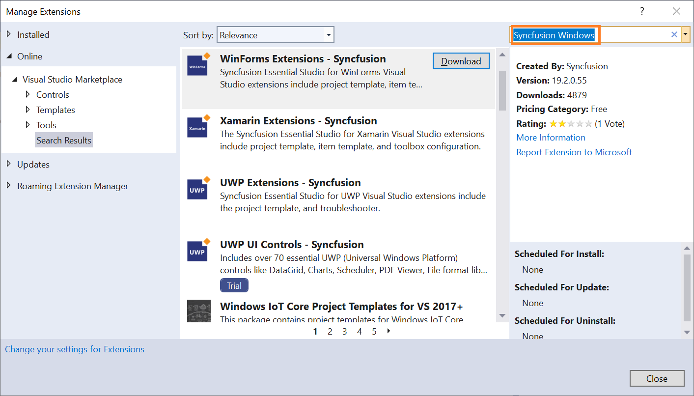
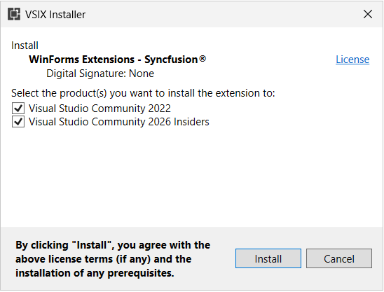
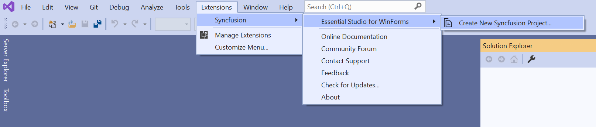

# Syncfusion WinForms Extensions : Download and Installation Guide

Syncfusion&reg; publishes the Visual Studio extension in the [Visual Studio marketplace](https://marketplace.visualstudio.com/items?itemName=SyncfusionInc.Windows-Extensions). You can either install it directly from Visual Studio or download and install it from the Visual Studio marketplace.

## Prerequisites

The following software prerequisites must be installed to install the Syncfusion&reg; WinForms extension, as well as to create, add snippets, convert, and upgrade Syncfusion&reg; WinForms applications.

* [Visual Studio 2010 or later](https://visualstudio.microsoft.com/downloads).

## Install through the Visual Studio Manage Extensions

The steps below assist you with how to install the Syncfusion&reg; WinForms extensions from **Visual Studio Manage Extensions**.

1. Open Visual Studio.

    N>  In Visual Studio 2017 or lower, go to Tools -> Extensions and Updates.

2. Navigate to **Extensions -> Manage Extensions** to open the Manage Extensions dialog.

3. On the left, click the **Online** tab and type **"Syncfusion&reg; Windows"** in the **search box**.

    

4. Click the **Download** button for the **“WinForms Extensions - Syncfusion&reg;”**.

5. Close all Visual Studio instances after downloading the extensions to begin the installation process. You will see the following VSIX installation prompt.

    

6. Click the **Modify** button.

7. After the installation is complete, open Visual Studio.

8. Now, under the menu **Extensions**, you can use the Syncfusion&reg; extensions from Visual Studio.

    

## Install from the Visual Studio Marketplace

The steps below illustrate how to download and install the Syncfusion&reg; WinForms extension from the Visual Studio Marketplace.

1. Download the [Syncfusion&reg; WinForms Extensions](https://marketplace.visualstudio.com/items?itemName=SyncfusionInc.Windows-Extensions) from the Visual Studio Marketplace.

2. Close all running Visual Studio instances, if any.

3. Double-click the downloaded VSIX file to install it. The installer will display prompts to install the extension in any available Visual Studio instances. If no Visual Studio installation is detected, the extension cannot be installed.

    

4. Click the **Modify** button.

5. After the installation is complete, open Visual Studio. You can now use the Syncfusion&reg; extensions from Visual Studio under the **Extensions** menu.

     