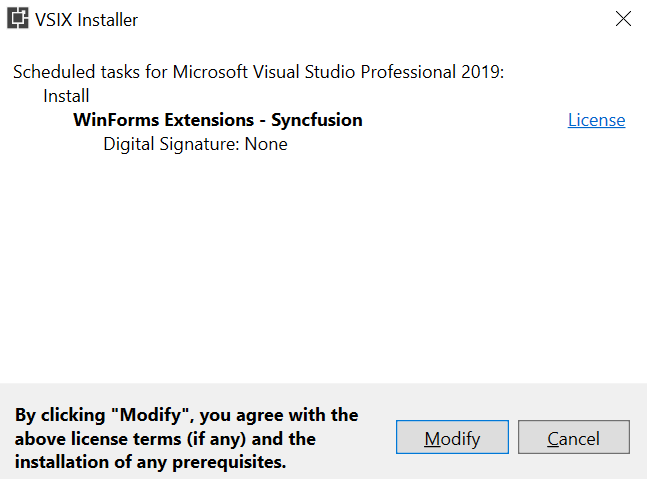

# Syncfusion WinForms Extensions : Download and Installation Guide

Syncfusion&reg; publishes the Visual Studio extension in the [Visual Studio marketplace](https://marketplace.visualstudio.com/items?itemName=SyncfusionInc.Windows-Extensions). You can either install it directly from Visual Studio or download and install it from the Visual Studio marketplace.

## Prerequisites

The following software prerequisites must be installed to install the Syncfusion&reg; WinForms extension, as well as to creating, adding snippet, converting, and upgrading Syncfusion&reg; WinForms applications.

* [Visual Studio 2010 or later](https://visualstudio.microsoft.com/downloads).

## Install through the Visual Studio Manage Extensions

The steps below assist you to how to install the Syncfusion&reg; WinForms extensions from **Visual Studio Manage Extensions**.

1. Open the Visual Studio.

    N>  In Visual Studio 2017 or lower, go to Tools -> Extensions and Updates

2. Navigate to **Extension ->Manage Extensions** and open the Manage Extensions.

3. On the left, click the **Online** tab and type **"Syncfusion&reg; Windows"** in the **search box**.

    

4. Click the **Download** button in the **“WinForms Extensions - Syncfusion&reg;”**.

5. Close all Visual Studio instances after downloading the extensions to begin the installation process. You will see the following VSIX installation prompt.

    

6. Click the **Modify** button.

7. After the installation is complete, open Visual Studio.

8. Now, under the menu **Extensions**, you can use the Syncfusion&reg; extensions from the Visual Studio.

    

## Install from the Visual Studio Marketplace

The steps below illustrate how to download and install the Syncfusion&reg; Windows extension from the Visual Studio Marketplace.

1. Download the [Syncfusion&reg; WinForms Extensions](https://marketplace.visualstudio.com/items?itemName=SyncfusionInc.Windows-Extensions) from the Visual Studio Marketplace.

2. Close all Visual Studio instances running, if any.

3. Double-click the downloaded VSIX file to install. The installer will display prompts to install the extension in any available Visual Studio instances. If no Visual Studio installation is detected, the extension cannot be installed.

    

4. Click the **Modify** button.

5. After the installation is complete, open Visual Studio. You can now use Syncfusion&reg; extensions from the Visual Studio under the **Extensions** menu.

     