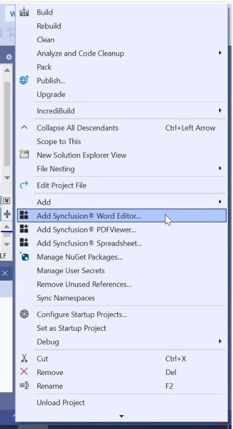
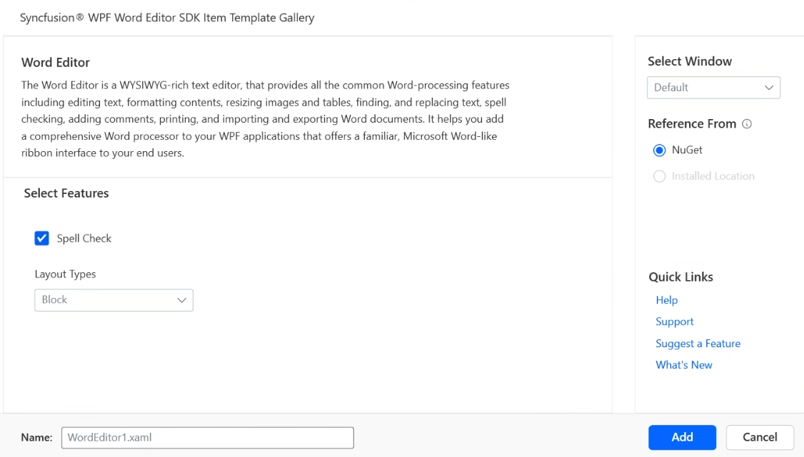
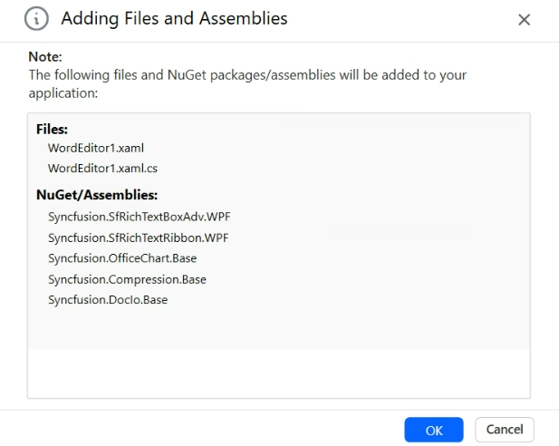

# Add Syncfusion&reg; Components to the WPF Application

Syncfusion&reg; supports Visual Studio Item Templates to add Syncfusion&reg; WPF Components to a WPF application with Syncfusion&reg; WPF references. 

I> The Syncfusion&reg; WPF Word Editor SDK Item Templates are available from v30.1.37. 

The following steps will guide you to add the Syncfusion&reg; WPF Components to your Visual Studio WPF application.

## Add Components using Syncfusion&reg; Item Template

1.	Open a new or existing WPF application.

	**Option 1:**

2.	From the **Solution Explorer, right-click** on the WPF application. Choose **Add Syncfusion&reg; Word Editor...**.

	

	**Option 2:**

3.	Click **Extensions > Essential Studio&reg; for Word Editor SDK > Add Syncfusion&reg; Item…** in Visual Studio.

	

4.	The Syncfusion&reg; WPF Word Editor SDK Item Template wizard will be launched as follows.

	

5.	Select the WPF Components from the Component list within your WPF Item Template. The features associated with the selected Component will be presented. From here, 		choose the specific features that are essential&reg; for your project.

6.	Choose an assembly reference option such as GAC location, Essential Studio&reg; installed location, or NuGet packages to specify where the required Syncfusion&reg; assemblies 	are added to the project.

	N> If the Syncfusion&reg; Essential&reg; WPF build is installed, the Installed location and GAC options will be enabled. Without installing the Syncfusion&reg; Essential&reg; WPF setup, use the NuGet option. The GAC option will not be available when using the Syncfusion&reg; WPF Components in a .NET Core application. The Version drop-down lists the installed WPF versions.

7.  Click **Add**, and a pop-up will appear providing information about adding Component **files** and **NuGet/Assemblies** details.

		

8.	Click **OK** to incorporate the chosen Components into the WPF application, along with the necessary Syncfusion&reg; assemblies.

	

9.	Then, Syncfusion&reg; licensing registration required message box will be shown if you installed the trial setup or NuGet packages since Syncfusion&reg; introduced the 			licensing system from 2018 Volume 2 (v16.2.0.41) Essential Studio&reg; release. Navigate to the [help topic](https://help.Syncfusion.com/common/essential-studio/licensing/license-key#how-to-generate-Syncfusion-license-key), which is shown in the licensing message box to generate and register the Syncfusion&reg; license key to 		your project. Refer to this [blog](https://blog.Syncfusion.com/post/Whats-New-in-2018-Volume-2-Licensing-Changes-in-the-1620x-Version-of-Essential-Studio.aspx) post 	for understanding the licensing changes introduced in Essential Studio&reg;.

	