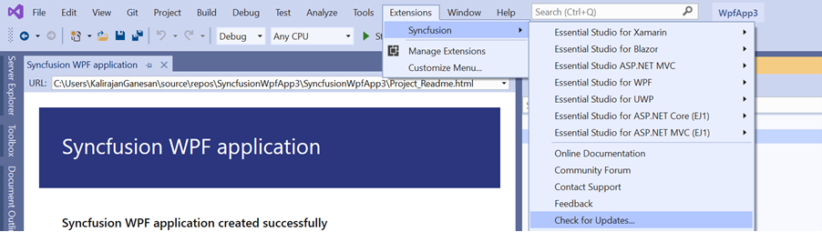
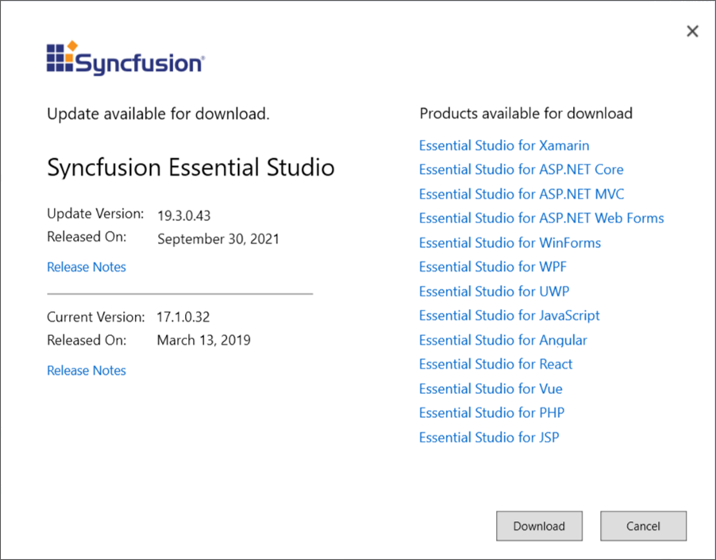

# Check for Updates in Syncfusion&reg;  Xamarin

Syncfusion&reg; provides Extensions to update the most recent version of the Essential Studio&reg;  release. Installing the most recent version ensures that you always have the most up-to-date features, fixes, and improvements.

I> The Syncfusion&reg;  Check for updates is available from v17.1.0.32.

You can check updates availability in Visual Studio, and then install the update version if required.

1. Choose **Syncfusion -> Check for Updates…** in the Visual Studio menu

   

   N> From Visual Studio 2019, Syncfusion&reg;  menu is available under Extensions in Visual Studio menu.

   
   
2. When an update is available, the Update dialog box appears.

   

3. You can download the Syncfusion&reg;  Essential Studio&reg;  from the Syncfusion&reg;  website by selecting **Download**.
