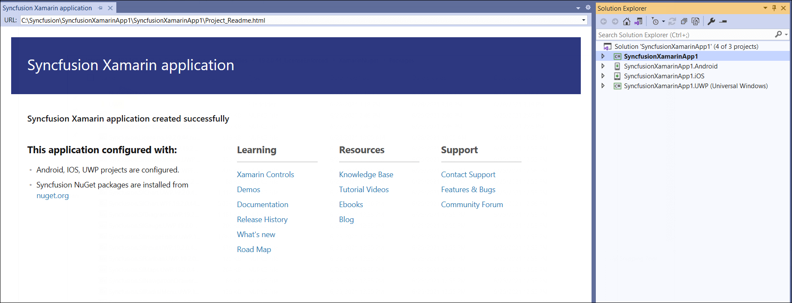
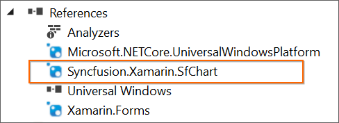

# Creating Syncfusion Xamarin Application

Syncfusion provides Visual Studio Project Templates for the Syncfusion Xamarin platform, allowing you to quickly develop a Syncfusion Xamarin application by just adding the needed Syncfusion NuGet packages for the control you want to use.

I> The Syncfusion Xamarin Project Templates are available from v16.2.0.41.

To create the **Syncfusion Xamarin Application** in Visual Studio 2017, follow these steps

> Check whether the **Xamarin Extensions - Syncfusion** are installed or not in Visual Studio Extension Manager by going to **Tools -> Extensions and Updates -> Installed** for Visual Studio 2017 or lower, and **Extensions -> Manage Extensions -> Installed** for Visual Studio 2019 by going to **Extensions -> Manage Extensions -> Installed**. If this extension not installed, please install the extension by follow the steps from the [download and installation](download-and-installation) help topic.

1.	Follow one of the instructions below to create a Syncfusion Xamarin project

   **Option 1:**  
   Click **Syncfusion Menu** and choose **Essential Studio for Xamarin > Create New Syncfusion Project…** in **Visual Studio**.

   

   N> From Visual Studio 2019, Syncfusion menu is available under Extensions in Visual Studio menu.

   

   **Option 2:**  
   Choose **File > New > Project** and navigate to **Syncfusion > Cross-Platform > Syncfusion Xamarin Project Template** in **Visual Studio**.

   

   In Visual Studio 2019, Syncfusion Xamarin project creation wizard like below.

   

2.	Click OK once you've given the project  name, selected a destination location, and set the project's Framework. The Project Configuration Wizard is now displayed.
   
3.	Choose the Project, Android, iOS, and UWP by on/off in the following Project Configuration window to configure the Syncfusion Xamarin Application.

    

   **Project Configuration:**

   **Assemblies From:** Choose NuGet or Installed Location to load the Syncfusion Xamarin reference into Xamarin Application.

   N> Installed location option will be shown only when the Syncfusion Xamarin setup has been installed.

   **Android**

   1. **Minimum Android Version:** Choose the earliest Android version for which you want to provide support for your app. 
   2. **Target Android Version:** Choose the Android version on which your app will run. 

   **iOS**

   1. **Target Device:**  Choose the Xamarin.iOS device of Xamarin.iOS project either Unified, iPhone/iPod, or iPad.
   2.	**Target Version:** Select the Xamarin.iOS Project version.

   **Choose controls:** To create the Syncfusion Xamarin application, choose at least one Syncfusion control. 

   N> If you want to add other Syncfusion Xamarin controls in the created Syncfusion Xamarin application, you can use our [Syncfusion Xamarin toolbox](https://help.syncfusion.com/xamarin/visual-studio-integration/visual-studio-extensions/toolbox-control)

   

4. The Syncfusion Xamarin Application has been created when you click Create.

   N> Choose any one of the project type and controls from Project Configuration Wizard.

   

5. Based on the control selected, required Syncfusion NuGet/Assemblies and configuration have been added to the project.

   **Net Standard /PCL**

   

   

   **Android**

   

   

   **iOS**

   

   

   **UWP**

   

   

6. Then, Syncfusion licensing registration required message box will be shown if you installed the trial setup or NuGet packages since Syncfusion introduced the licensing system from 2018 Volume 2 (v16.2.0.41) Essential Studio release. Navigate to the [help topic](https://help.syncfusion.com/common/essential-studio/licensing/license-key#how-to-generate-syncfusion-license-key), which is shown in the licensing message box to generate and register the Syncfusion license key to your project. Refer to this [blog](https://blog.syncfusion.com/post/Whats-New-in-2018-Volume-2-Licensing-Changes-in-the-1620x-Version-of-Essential-Studio.aspx) post for understanding the licensing changes introduced in Essential Studio.

   

