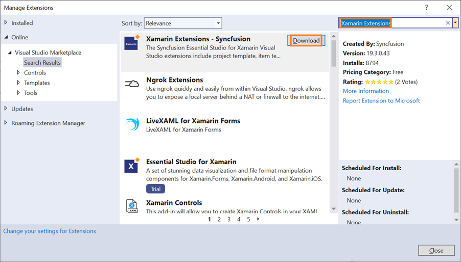
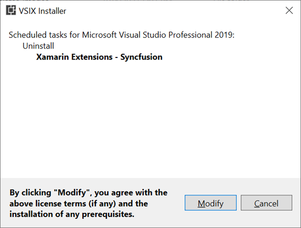
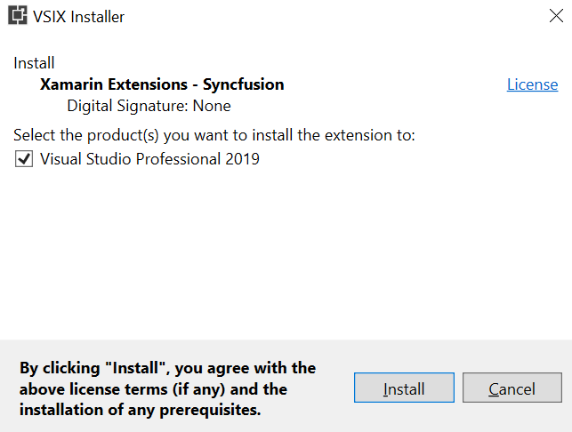

# Download and Installation

In [Visual Studio marketplace]https://marketplace.visualstudio.com/items?itemName=SyncfusionInc.XamarinExtension), Syncfusion publishing the Xamarin Visual Studio extension. You can either use the Visual Studio to install it or go to the Visual Studio marketplace to download and install it.

## Install through the Visual Studio Manage Extensions

The steps below assist you to how to install the Syncfusion Xamarin extensions from Visual Studio **Manage Extensions**.

1.	Open the Visual Studio.
2.	Navigate to **Extension -> Manage Extensions** and open the Manage Extensions.
	> In Visual Studio 2017 or lower, go to Tools -> Extensions and Updates
3.	On the left, click the **Online** tab and type **"Xamarin Extensions"** in the search box.

	
4.	Click the Download button in the “Xamarin Extensions - Syncfusion”.
5.	Close all Visual Studio instances after downloading the extensions to begin the installation process. You can see the following VSIX installation prompt.
	
	
6.	Click the **Modify** button.
7.	When the installation is finished, launch the Visual Studio.
8.	Now, you can use the Syncfusion extensions from Visual Studio under the Extensions menu.
	
	

##	Install from the Visual Studio Marketplace

The steps below illustrate how to download and install the Syncfusion Xamarin extension from the Visual Studio Marketplace.

1.	Download the [Syncfusion Xamarin Extensions](https://marketplace.visualstudio.com/items?itemName=SyncfusionInc.XamarinExtension) from the Visual Studio Marketplace.
2.	If any Visual Studio instances are still open, close them.
3.	Double-click on the downloaded VSIX file to install. You can see the VSIX installation prompts for the Visual Studio 2019 version. If Visual Studio 2019 is not installed, it will not be possible to install the extension
	
	
4.	Click the **Install** button.
5.	After the installation is complete, open Visual Studio 2019. You can now use Syncfusion extensions from the Visual Studio under the Extensions menu.
	
	