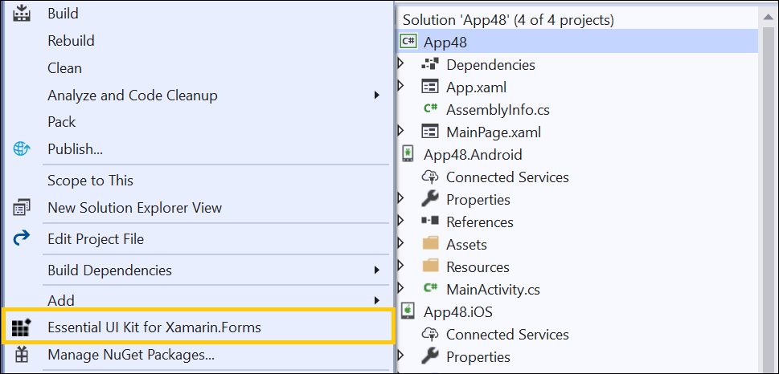
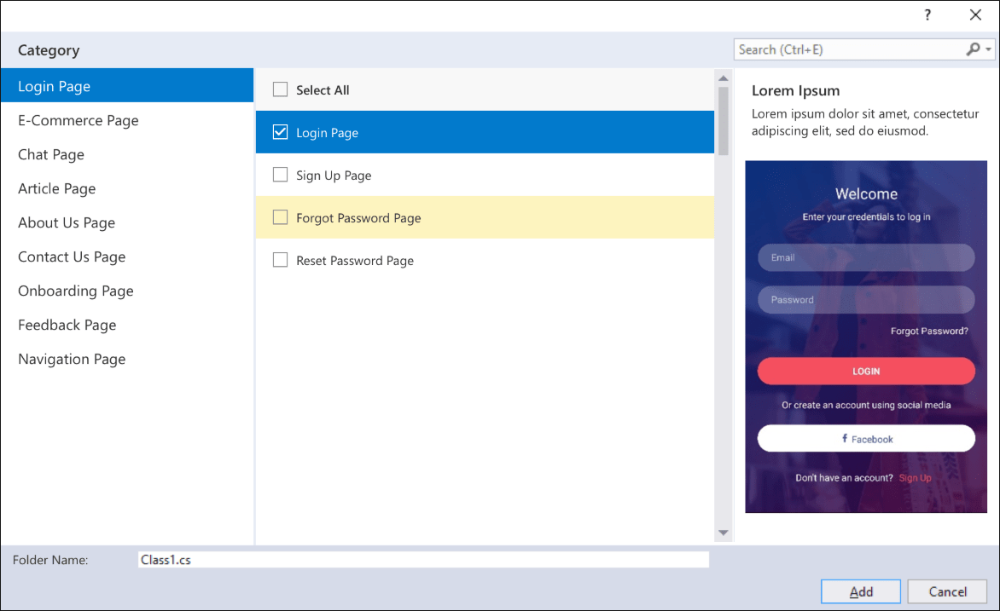
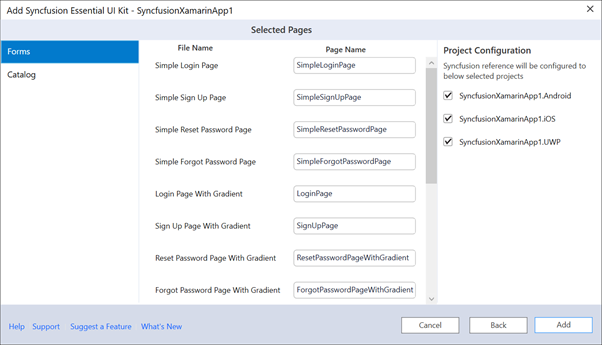
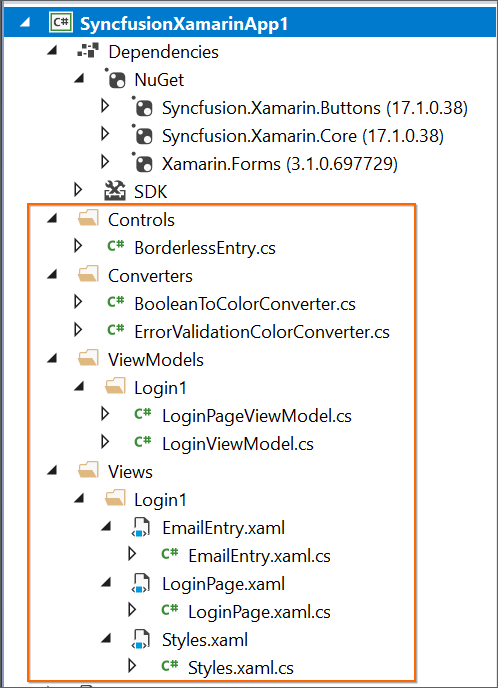
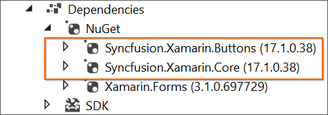
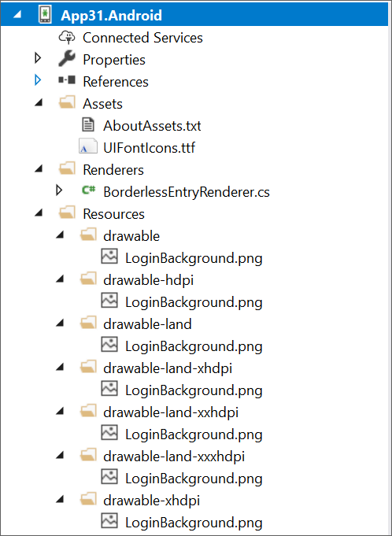

# Xamarin Essential UI Kit

Essential UI Kit for Xamarin.Forms includes predefined XAML templates for Xamarin.Forms apps. The UI kit allows to build a user interface in a cross-platform application. It clearly separates the View, View Model, and Model classes, making it simple to integrate your business logic and make changes to the existing view. 

## Installation of Xamarin UI Kit Extension

Install the appropriate [Xamarin UI Kit Extension](https://marketplace.visualstudio.com/items?itemName=SyncfusionInc.Essential-UI-Kit-Xamarin-Forms) in Visual Studio by downloading them from the marketplace. As a result, you can use the Syncfusion Extension from your project's Syncfusion menu.

## Include XAML templates in Xamarin.Forms apps

1.	Launch a new or existing Xamarin application.

2.	Select the Essential UI Kit for Xamarin.Forms from the Solution Explorer by right-clicking on your Xamarin.Forms project

	

	N> The Essential UI Kit for Xamarin.Forms add-in will be shown when the project has the Xamarin.Forms NuGet package as a reference and also, Xamarin.Forms project should be a NET Standard project.

3.	The Category dialogue box will then appear, with its pre-defined template.

	

4.	Now, select the required pages from any of the specified categories.

5.	If you want to edit your page name, then rename and choose projects which you want to add references.

	

6.	The selected pages will be added along with View, View Model, Model classes, resource files and Syncfusion NuGet package reference,

	

	

	

7.	Then, Syncfusion licensing registration required message box will be shown if you installed the trial setup or NuGet packages since Syncfusion introduced the licensing system from 2018 Volume 2 (v16.2.0.41) Essential Studio release. Navigate to the [help topic](https://help.syncfusion.com/common/essential-studio/licensing/license-key#how-to-generate-syncfusion-license-key), which is shown in the licensing message box to generate and register the Syncfusion license key to your project. Refer to this [blog](https://blog.syncfusion.com/post/Whats-New-in-2018-Volume-2-Licensing-Changes-in-the-1620x-Version-of-Essential-Studio.aspx) post for understanding the licensing changes introduced in Essential Studio. 

## Run the UI template item

To set the desired UI Template item as the start page of your application, Open the **App.xaml.cs** of Xamarin.Forms project and make the following changes.

MainPage=new application name.Views. 

**Item name**.selected template page name();

Example: If you added Login Page,

MainPage=new App1.Views.Login.LoginPage();