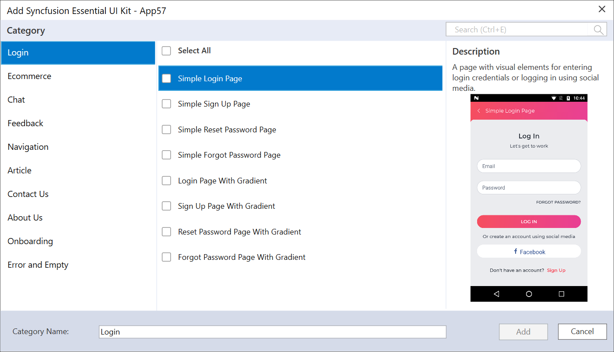

# Xamarin Essential UI Kit

Essential UI Kit for Xamarin.Forms includes predefined XAML templates for Xamarin.Forms apps. The UI kit allows to build a user interface in a cross-platform application. It provides a clear separation of View, View Model, and Model classes, so integrating your business logic and making changes in the existing view is simple. 

## Installation of Xamarin UI Kit Extension

Download the necessary [Xamarin UI Kit Extension](https://marketplace.visualstudio.com/items?itemName=SyncfusionInc.Essential-UI-Kit-Xamarin-Forms) from the market place and install them in your Visual Studio. So that, you can use the Syncfusion Extension from Syncfusion menu of your project.

## Creating Syncfusion Xamarin application

1. Open a new or existing Xamarin application.

2. Right-click on your **Xamarin.Form** project from the **Solution Explorer** and select the              **Syncfusion UI for Xamarin** option.

   

3. Then the Category dialog window will open with its predefined template   

   

4. Now, add the desired pages of the any number of predefined categories

5. The selected pages will be added along View, ViewModel, Model classes, resource files and Syncfusion NuGet package reference,

   

   

   

6. If you installed the trial setup or NuGet packages from nuget.org you have to register the Syncfusion license key to your project since Syncfusion introduced the licensing system from 2018 Volume 2 (v16.2.0.41) Essential Studio release. Navigate to the [help topic](https://help.syncfusion.com/common/essential-studio/licensing/license-key#how-to-generate-syncfusion-license-key) to generate and register the Syncfusion license key to your project. Refer to this [blog](https://blog.syncfusion.com/post/Whats-New-in-2018-Volume-2-Licensing-Changes-in-the-1620x-Version-of-Essential-Studio.aspx?_ga=2.11237684.1233358434.1587355730-230058891.1567654773) post for understanding the licensing changes introduced in Essential Studio.

## Template Selection and naming

The name of the categories such as Login, Chat, E-Commerce page can be changed while adding it to your project. Therefore, the corresponding category will be displayed with the provided name in the View, ViewModel and Model classes of the application.
The main advantage of category dialog window is to choose multiple pages from multiple categories of the UI templates at the time of addition.

## Run the UI template item

To set the desired UI Template item as the start page of your application, Open the **App.xaml.cs** and make the following changes.

MainPage=new application name.Views. 

**Item name**.selected template page name();

Example: If you added Login Page,

MainPage=new App1.Views.Login1.LoginPage();