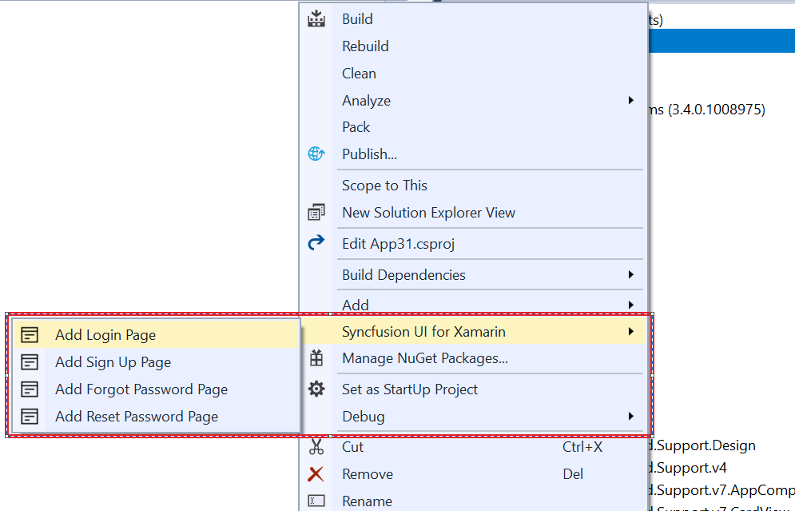

# Syncfusion Item Templates for Xamarin

The Syncfusion item templates extension provides a predefined design for the Xamarin.Forms. Follow the given steps to add the Syncfusion predefined files in Visual Studio. 

 N> Syncfusion Xamarin item template is available in Essential Studio version 17.1.0.32

## Add Syncfusion Xamarin Item Template 
Follow these steps to add the Syncfusion Xamarin item in Visual Studio:

1. Open a new or existing **Xamarin** application.
 
2. Select the **Xamarin.Forms** project. Follow any of the given options:

   **Option1:**  Select **Syncfusion > Essential Studio for Xamarin** from the top-level menu in Visual Studio and select the item template. Refer to the following screenshot for more information.

    

   **Option2:** Right-click the **Xamarin.Form** Project from the **Solution Explorer**. Select the **Syncfusion UI for Xamarin** option. Refer to the following screenshot for more information.

    

   **Option3:** Right-click the **Xamarin.Form** Project from the **Solution Explorer**. Select **Add > New Item**. Refer to the following screenshot for more information.
 
     
     

   The **Add New Item Dialog box** opens.

     

3. Now, click **ADD**. The selected template is added to the project along with **Syncfusion NuGet package references**.

   

   

   

## How to render the Syncfusion Xamarin item template
You should make the selected template page as startup page in this application. To do this, open the **App.xaml.cs** and make the following changes.

MainPage=new application name.Views. 
**Item name**.selected template page name();

Eg: If you added Login Page,

MainPage=new App1.Views.Login1.LoginPage();
