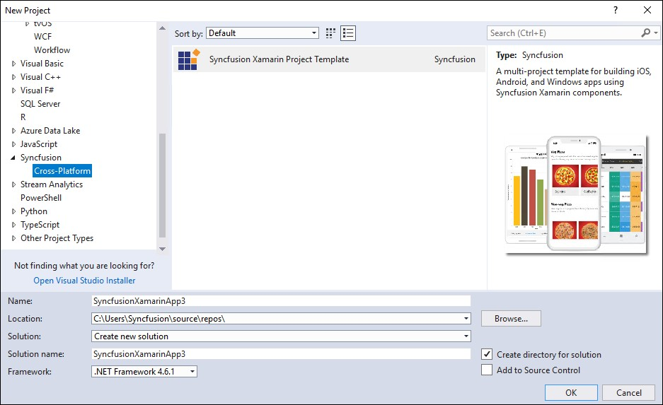
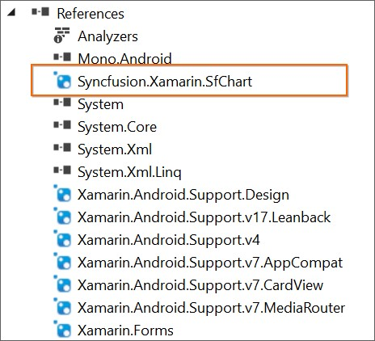
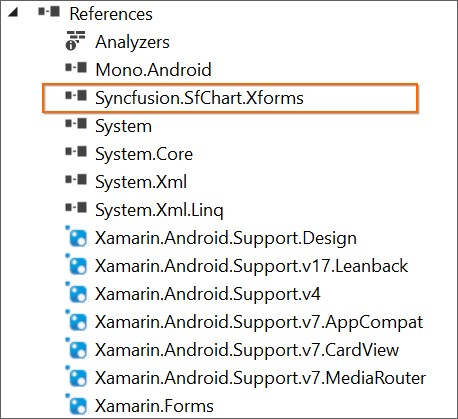
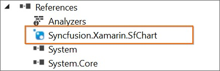
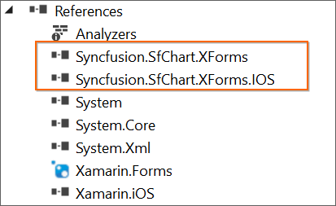
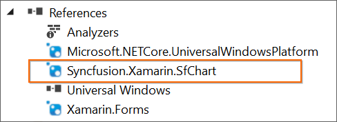

# Syncfusion Project Templates

Syncfusion provides the **Visual** **Studio** **Project** **Templates** for the Syncfusion Xamarin platform to create the Syncfusion Xamarin Application.

I> The Syncfusion Xamarin Project Templates are available from v16.2.0.41.

## Create Syncfusion Xamarin Application

The following steps direct you to create the **Syncfusion** **Xamarin** **Application** through the **Visual** **Studio** **2017:**

1. To create a **Syncfusion Xamarin project**, choose **New** **Project****->****Syncfusion****->** **Cross-Platform****->****Syncfusion** **Xamarin** **Application** from **Visual** **Studio** **2017**.

   

2. Name the **Project**, choose the destination location, and set the Framework of the project, and then click **OK**. The Project Configuration Wizard appears.
   
3. Choose the options to configure the Syncfusion Xamarin Application by using the following Project Configuration dialog.

### Project Configuration:

Choose the Project, Android, iOS, and UWP by on/off 

   

**Assemblies From:** Load the Syncfusion Xamarin reference to Xamarin Application, either NuGet or Installed Location.

  N> *Installed location option will be available only when installed the Syncfusion Xamarin setup has been installed*.

**Android:**

1.	**Minimum Android Version:** Select the oldest Android version that you want to support your application. 
2.	**Target Android Version:** Select the version of Android to run your application. 

**iOS:**

1.	**Target Device:**  Select the device of Xamarin iOS Project, either Unified, iPhone/iPod, or iPad.
2.	**Target Version:** Choose the version of Xamarin iOS Project

**Choose controls**

Choose the Xamarin application needs to create with the Syncfusion controls. 

1. Click **Create**, the Syncfusion Xamarin Application has been created.

N> *Choose any one of the project type and controls from Project Configuration Wizard.*

2.	Required Syncfusion NuGet/Assemblies and configuration have been added to the project based on the control chosen.

**Net Standard /PCL:**

 

**Android:**

**iOS:**

**UWP:**

