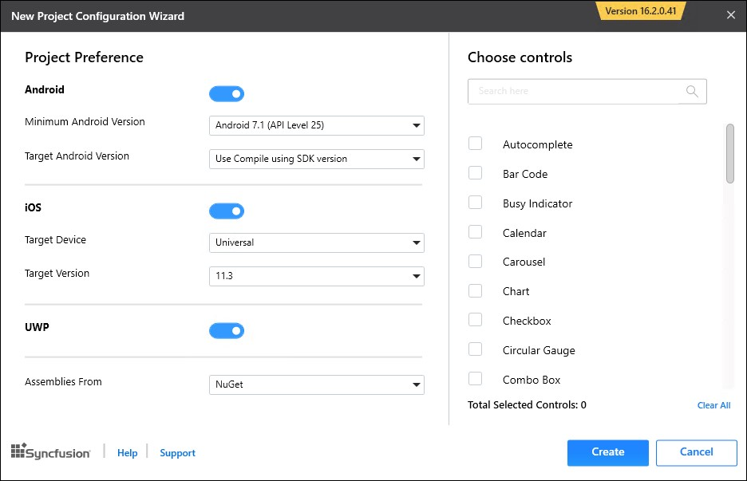
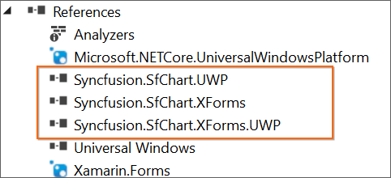

# Syncfusion Project Templates

Syncfusion provides the **Visual** **Studio** **Project** **Templates** for the Syncfusion Xamarin platform to create the Syncfusion Xamarin Application.

I> The Syncfusion Xamarin Project Templates are available from v16.2.0.41.

## Create Syncfusion Xamarin Application

The following steps direct you to create the **Syncfusion** **Xamarin** **Application** through the **Visual** **Studio** **2017:**

1. To create a **Syncfusion Xamarin project**, choose **New** **Project****->****Syncfusion****->** **Cross-Platform****->****Syncfusion** **Xamarin** **Application** from **Visual** **Studio** **2017**.

   

2. Name the **Project**, choose the destination location, and set the Framework of the project, and then click **OK**. The Project Configuration Wizard appears.
   
3. Choose the options to configure the Syncfusion Xamarin Application by using the following Project Configuration dialog.

### Project Configuration:

Choose the Project, Android, iOS, and UWP by on/off 

   

**Assemblies From:** Load the Syncfusion Xamarin reference to Xamarin Application, either NuGet or Installed Location.

  N> *Installed location option will be available only when installed the Syncfusion Xamarin setup has been installed*.

**Android:**

1.	**Minimum Android Version:** Select the oldest Android version that you want to support your application. 
2.	**Target Android Version:** Select the version of Android to run your application. 

**iOS:**

1.	**Target Device:**  Select the device of Xamarin.iOS Project, either Unified, iPhone/iPod, or iPad.
2.	**Target Version:** Choose the version of Xamarin.iOS Project.

**Choose controls**

Choose the Xamarin application needs to create with the Syncfusion controls. 

4.Click **Create**, the Syncfusion Xamarin Application has been created.

   N> *Choose any one of the project type and controls from Project Configuration Wizard.*

5.Required Syncfusion NuGet/Assemblies and configuration have been added to the project based on the control chosen.

**Net Standard /PCL:**

**Android:**

**iOS:**

**UWP:**

6.Then, Syncfusion licensing registration required message box will be shown as follow, if you are installed the trial setup or NuGet packages since Syncfusion introduced the licensing system from 2018 Volume 2 (v16.2.0.41) Essential Studio release. Please navigate to the [help topic](https://help.syncfusion.com/common/essential-studio/licensing/license-key#how-to-generate-syncfusion-license-key) which is shown in the licensing message box to generate and register the Syncfusion license key to your project. Refer to this [blog](https://blog.syncfusion.com/post/Whats-New-in-2018-Volume-2-Licensing-Changes-in-the-1620x-Version-of-Essential-Studio.aspx) post for understanding the licensing changes introduced in Essential Studio.

