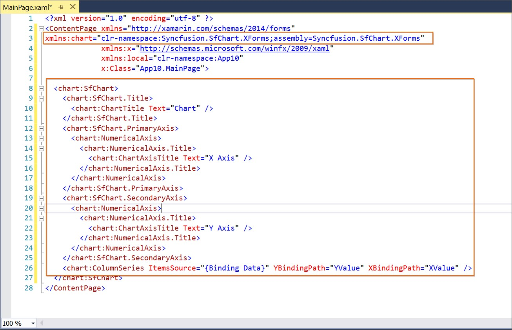

# Syncfusion Xamarin Toolbox

Syncfusion provides the **Visual** **Studio** **Toolbox** for the Syncfusion Xamarin platform to adding the Syncfusion Xamarin (Xamarin.Forms) controls in your project. It supports Microsoft Visual Studio 2015 and 2017. The Syncfusion Xamarin toolbox helps you to use the Syncfusion controls without coding in the Visual Studio designer.

I> The Syncfusion Toolbox are available from v16.2.0.41.

## Add Syncfusion Xamarin (Xamarin.Forms) Controls in your Project

Create the Xamarin or Syncfusion Xamarin project. The following steps direct you to add the Syncfusion controls through the Visual Studio Toolbox:

1. Choose **View** **->** **Other** **Windows** **->** **Syncfusion** **Toolbox** from **Visual** **Studio.**

   

2. Click **Syncfusion** **Toolbox** menu item, the Syncfusion Toolbox wizard has been appeared. The Syncfusion control will be enabled in the Xamarin.Forms designer page. There is no Syncfusion control appears till open the appropriate .xaml file from the Xamarin shared/.NET Standard /PCL project.

   

3. Add the required Syncfusion controls design (.xaml) snippet and namespace by drag and drop the required control from toolbox to designer.

   

4. Install the Syncfusion Xamarin NuGet packages based on the controls in your project and render the Syncfusion control. Refer the following link for know more about Syncfusion Xamarin NuGet packages install and configuration: [https://help.syncfusion.com/xamarin/nuget-packages](https://help.syncfusion.com/xamarin/nuget-packages)
