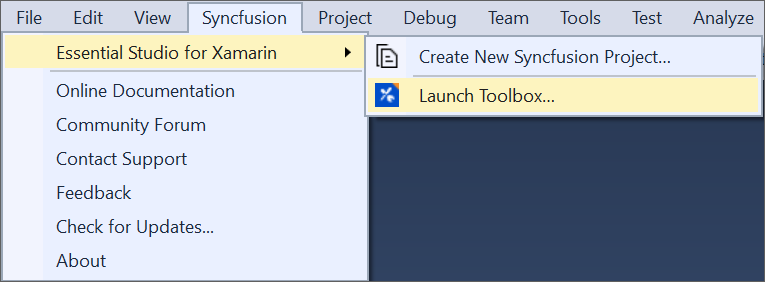
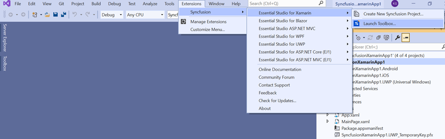
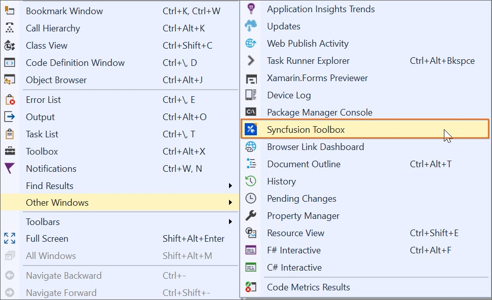
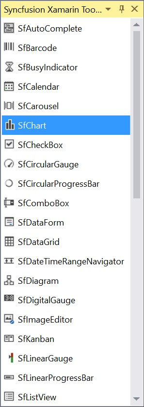
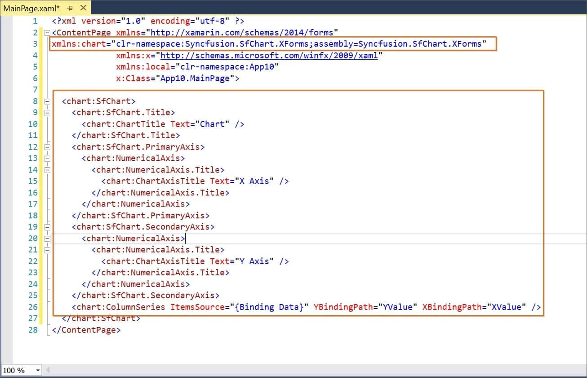

# Xamarin Toolbox control

To include the Syncfusion Xamarin (Xamarin. Forms) controls in your project, Syncfusion provides a customized **Visual Studio Toolbox** for the Syncfusion Xamarin platform. It supports Microsoft Visual Studio 2017 and later. The Syncfusion Xamarin toolbox helps you use the Syncfusion controls without coding in the Visual Studio designer.

I> The Syncfusion Xamarin Toolbox is available from v16.2.0.41.

Create a Microsoft Xamarin project or Syncfusion Xamarin project by using Syncfusion project template. The steps below will guide you through adding the Syncfusion controls to the Visual Studio Toolbox:

> Check whether the **Xamarin Extensions - Syncfusion** are installed or not in Visual Studio Extension Manager by going to **Tools -> Extensions and Updates -> Installed** for Visual Studio 2017 or lower, and **Extensions -> Manage Extensions -> Installed** for Visual Studio 2019 by going to **Extensions -> Manage Extensions -> Installed**. If this extension not installed, please install the extension by follow the steps from the [download and installation](xamarin/visual-studio-integration/vs2019-extensions/download-and-installation) help topic.

1. Follow one of the choices below to launch the Syncfusion Toolbox Wizard:

   **Option 1:**  
   Click **Syncfusion Menu** and choose **Essential Studio for Xamarin > Launch Toolbox…** in **Visual Studio**.

   

   N> From Visual Studio 2019, Syncfusion menu is available under Extensions in Visual Studio menu.

   

   **Option 2:**  
   Choose **View > Other Windows > Syncfusion Toolbox** in **Visual Studio**.

   
   
2. The Syncfusion Toolbox wizard opens when you click the **Syncfusion Toolbox** menu item. When you access the Xamarin.Forms designer page, the Syncfusion control will be enabled. Until you open the appropriate xaml file from the Xamarin shared/.NET Standard /PCL project, no Syncfusion control appears.

   

3. By dragging and dropping the required control from the toolbox to the designer, the required Syncfusion controls design (.xaml) snippet and namespace will be inserted.

   

   Furthermore, the required control Syncfusion Xamarin NuGet packages will be installed automatically when you drag and drop the control to the designer to render the Syncfusion control.

4. Then, Syncfusion licensing registration required message box will be shown if you installed the trial setup or NuGet packages since Syncfusion introduced the licensing system from 2018 Volume 2 (v16.2.0.41) Essential Studio release. Navigate to the [help topic](https://help.syncfusion.com/common/essential-studio/licensing/license-key#how-to-generate-syncfusion-license-key), which is shown in the licensing message box to generate and register the Syncfusion license key to your project. Refer to this [blog](https://blog.syncfusion.com/post/Whats-New-in-2018-Volume-2-Licensing-Changes-in-the-1620x-Version-of-Essential-Studio.aspx) post for understanding the licensing changes introduced in Essential Studio..