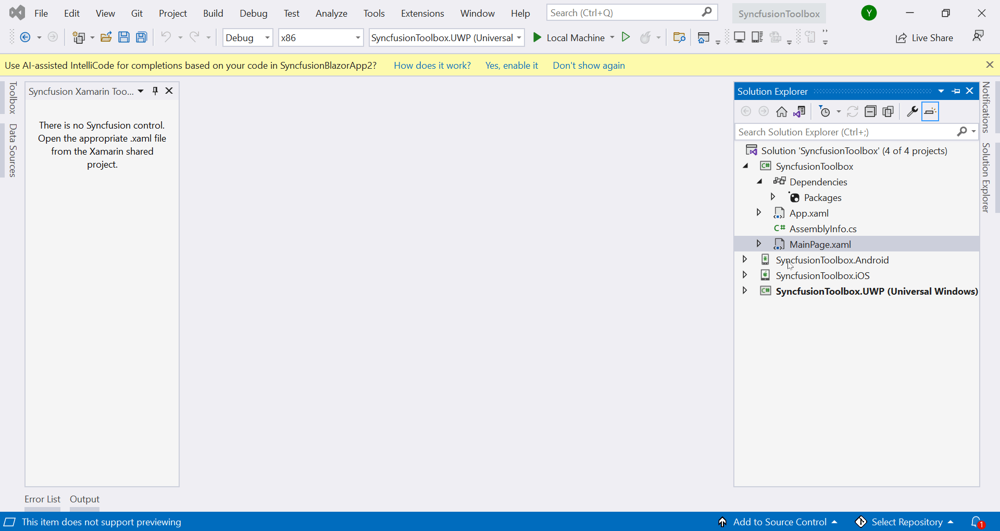

# Syncfusion&reg; Xamarin Toolbox

Syncfusion&reg; provides a Syncfusion&reg; **Visual Studio** Toolbox for the Xamarin platform to include the Syncfusion&reg; Xamarin (Xamarin.Forms) components in Xamarin application. It supports from Visual Studio 2017. The Syncfusion&reg; Xamarin toolbox allows you to add a Syncfusion&reg; Xamarin component code to the application effortlessly at the appropriate place in the XAML design file.

I> The Syncfusion&reg; Xamarin Toolbox is available from Essential Studio&reg; 2018 Volume 2(v16.2.0.41).

> Check whether the **Xamarin Extensions - Syncfusion&reg;** are installed or not in Visual Studio Extension Manager by navigating to **Tools -> Extensions and Updates -> Installed** for Visual Studio 2017, and **Extensions -> Manage Extensions -> Installed** for Visual Studio 2019 by navigating to **Extensions -> Manage Extensions -> Installed**. If this extension not installed, please install the extension by follow the steps from the [download and installation](download-and-installation) help topic.

## Launching Syncfusion&reg; Xamarin Toolbox from Syncfusion&reg; menu

**Visual Studio 2019 and later**

To launch the Syncfusion&reg; Toolbox from Visual Studio 2019 and later, click **Extensions** in Visual Studio menu and choose **Syncfusion&reg; > Essential Studio&reg; for Xamarin > Launch Toolbox…**

   

**Visual Studio 2017**

To launch the Syncfusion&reg; Toolbox from Visual Studio 2017, click **Syncfusion&reg;** in Visual Studio menu and choose **Essential Studio&reg; for Xamarin > Launch Toolbox...**

   

## Launching Syncfusion&reg; Xamarin Toolbox from View menu

To launch the Visual Studio Toolbox from Visual Studio menu in Visual Studio 2017 and later, click **View > Other Windows > Syncfusion&reg; Toolbox** in Visual Studio.

   

> You can also find the Syncfusion&reg; Toolbox option  by typing "Syncfusion&reg; Toolbox" into the Quick Launch search field (top right corner in Visual Studio).

   

## Render Syncfusion&reg; components 
   
1.	When you click the Syncfusion&reg; Toolbox window, the Syncfusion&reg; Toolbox wizard is launched, and Syncfusion&reg; components are enabled once you access your application's designer page (XAML). Syncfusion&reg; components will not appear until open the appropriate  design (XAML) file from the Xamarin shared/.NET Standard/PCL project. The rendering of the Syncfusion&reg; Xamarin components is made as simple as possible. All you need to do simply dragging and dropping the Syncfusion&reg; Xamarin component from the Syncfusion&reg; toolbox into the designer. The selected component's code snippet and namespace will be added to the designer page(XAML) and  the required Syncfusion&reg; Xamarin NuGet packages will be installed.

      

2. Then, Syncfusion&reg; licensing registration required message box will be shown if you installed the trial setup or NuGet packages since Syncfusion&reg; introduced the licensing system from 2018 Volume 2 (v16.2.0.41) Essential Studio&reg; release. Navigate to the [help topic](https://help.syncfusion.com/common/essential-studio/licensing/overview#how-to-generate-syncfusion-license-key), which is shown in the licensing message box to generate and register the Syncfusion&reg; license key to your project. Refer to this [blog](https://blog.syncfusion.com/post/Whats-New-in-2018-Volume-2-Licensing-Changes-in-the-1620x-Version-of-Essential-Studio.aspx) post for understanding the licensing changes introduced in Essential Studio&reg;.